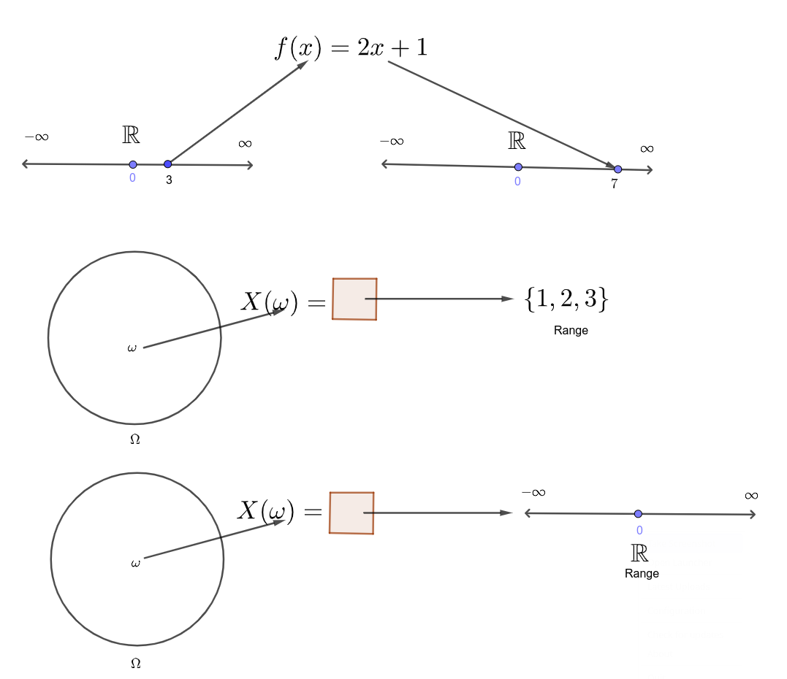

 

 

{width=40%}

 
 

Salam Everyone! Welcome to the course webpage of ECO 104 (Faculty - STH). 

This is the first course in the sequence of two Statistics courses offered for the Economics and Business students at EWU (the next one is ECO 204). The course will cover

- Basic ideas about Statistics and Data Sets.
- Some Descriptive Statistics (graphical and numerical methods).
- Introduction to Probability Theory (i.e., defining Probability, Random Variables and Distributions).
- Ideas about Sampling Distributions.
- Index numbers.

The approach of the class includes both learning the concepts and also how to apply them in real-life situations. Students will also be introduced to Microsoft Excel for applications related to business and economic data

 
 

{width=40%}

You will get the course outline in PDF soon.... 

 

  © ECO 104 Summer 2025. All rights reserved. |Site Maintained by - Shaikh Tanvir Hossain and Habiba Afroz

