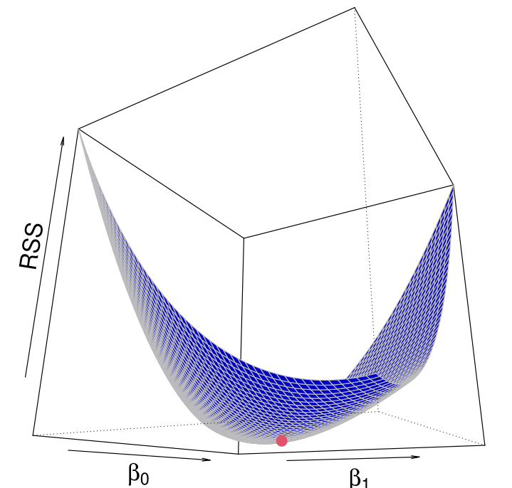
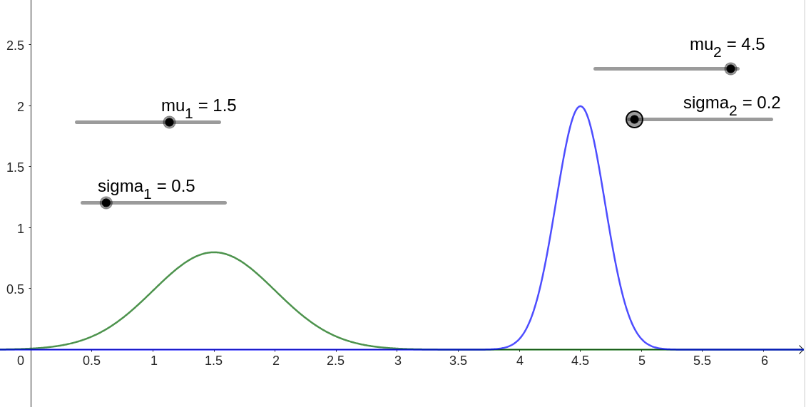

 
 

<table>
  <tr>
    <td></td>
    <td></td>
  </tr>
</table>

 
 

Assalamualaikum Students! 👋 

A warm welcome to all of you to the course **ECO 104 – Statistics for Business and Econmics - I, Sections 7 & 9 (Summer 2025)**. This is the first course in a sequence of two Statistics courses that you will be taking as part of your undergraduate program in Business and Economics. 📚 

In this course our primary goal is to focus on two key areas: **Descriptive Statistics** and **Probability Theory**. 

We will start with the **Descriptive Statistics** part. Here you’ll learn how to present raw data clearly through visual tools such as **bar charts, histograms, box-plots, and scatter-plots** 📊, and then through numerical measures including the **sample mean, median, variance, standard deviation, and quantiles**. The goal is to help you recognise patterns, spot outliers, and summarise a dataset with clarity. 

From description we move to **Probability Theory** part, which is the formal **language of uncertainty**. 🎲 We will define **what is probability**, learn **probability rules**, introduce **random variables** and their **probability distributions**, and explore core parametric distribution models such as the **Binomial, Poisson, and Normal**. Concepts like **Expectation and Variance** will give you a precise way to quantify risk and variability in real-world situations.

A quick heads-up: **PLEASE, and PLEASE again ... show up to every class.** This summer term is short, and each session builds on the previous one, so **missing even a single class can make your life very difficult later**.

We’re **Tanvir Hossain** (your instructor) and **Habiba Afroz** (the TA for this course) from the [Economics Department at East West University](https://fbe.ewubd.edu/economics-department). Reach out anytime to us via Discord DM, Google Classroom, or office hours—if you need help or just want to talk about Statistics. Thanks again, let’s have a great term together!

You will get the course outline in PDF soon.... please check the webpage frequently for updates.

 

{width=70%}

